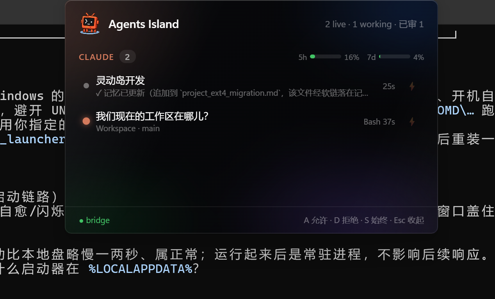
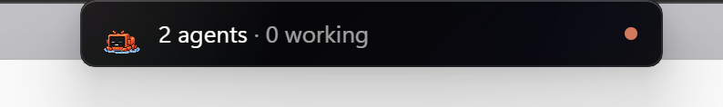
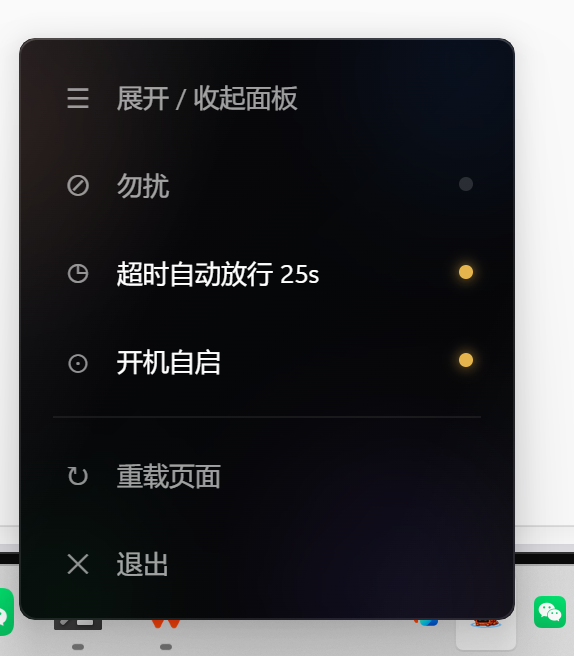
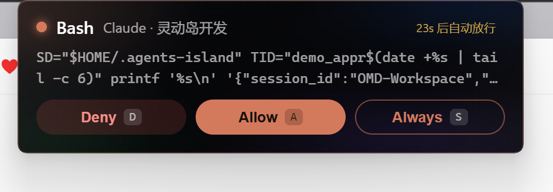
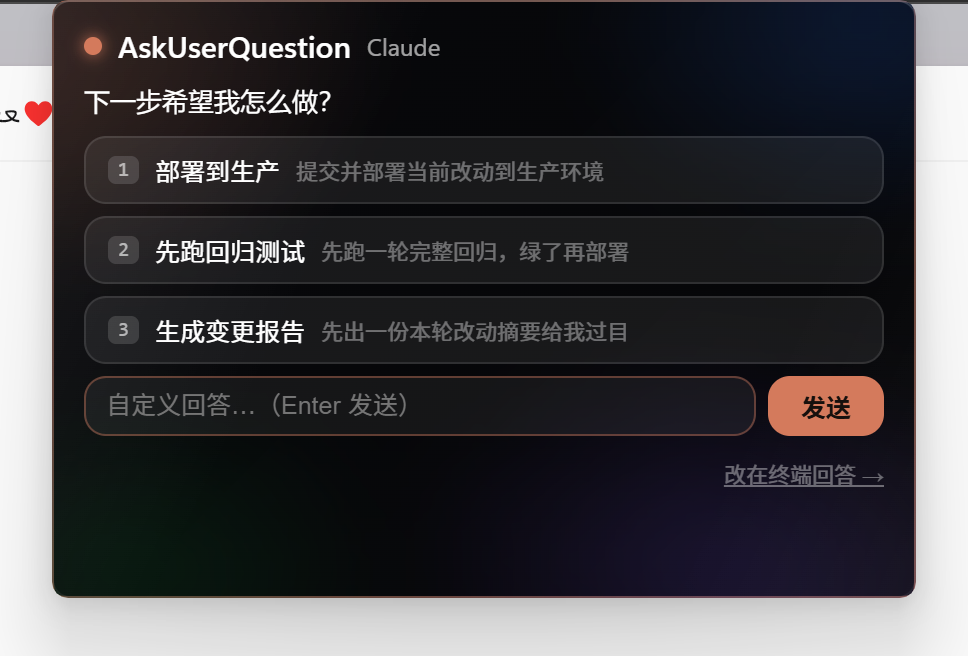

# Agents Island 🏝️

iOS 灵动岛风格的 Coding Agent 监控台：停靠 Windows 屏幕顶部居中，监控 WSL 内
Claude Code / Codex / AGY(Antigravity) / Kimi CLI / Gemini CLI 实例，审批事件
自动弹出，hover 唤出、点击展开全量实例面板。视觉为 iOS27 液态玻璃
（窗口内部 ambient 极光 + feDisplacementMap 折射玻璃幕）。

> 🤖 **Coding agents**: see [`AGENTS.md`](AGENTS.md) for machine-actionable install / run / extend instructions.

## 截图

<p align="center">
  <br><br>
  
  &nbsp;&nbsp;
  
</p>

<p align="center">
  
  &nbsp;&nbsp;
  
</p>

## 各 Agent 支持矩阵

| 能力 | Claude | Codex | Kimi | AGY | Gemini |
|------|--------|-------|------|-----|--------|
| 会话监控（分组/状态/标题） | ✅ | ✅ | ✅ | ✅ | ✅ |
| 审批上岛（Deny/Allow/Always） | ✅ hooks | ✅ hooks | ✅ hooks | — | — |
| AskUserQuestion 岛上作答 | ✅ | — | ✅（schema 同构） | — | — |
| 订阅额度条（分组头） | ✅ statusline | ✅ rollout | — | — | — |
| 会话 context 占用 % | — | — | ✅ wire.jsonl | — | — |

**接新 CLI（适配器约定）**：`bridge/vendor/` 加 `<name>_monitor.py`（返回
session_id/slug/project/cwd/status/last_tool/age_seconds/runtime/is_live/source），
在 `island_bridge.py` 的 `SESSION_ADAPTERS` 登记一行即可——UI 按 `state.sessions`
键数据驱动渲染，未知 agent 自动获得分组（兜底色+大写标签）。

```
┌────────────────────────── Windows 本机 ──────────────────────────┐
│  win/island.py（pywebview 6.1 + WebView2，无边框/透明/置顶）       │
│  全局热键 RegisterHotKey：Ctrl+Alt+A / D / S / Q                  │
└──────────────┬───────────────────────────────────────────────────┘
               │ http://127.0.0.1:5599（WSL2 localhost 转发）
┌──────────────▼────────────── WSL（任意发行版） ─────────────────────┐
│  bridge/island_bridge.py（stdlib HTTP，零第三方依赖）              │
│   ├─ 只读 import vendor/{claude,codex,agy,gemini,kimi}_monitor  │
│   ├─ 尾随 /tmp/claude_perm_queue.jsonl（inode+offset，防截断）     │
│   └─ 写 /tmp/claude_perm_responses/<id>.json + always 标志        │
└───────────────────────────────────────────────────────────────────┘
```

## 启动

| 方式 | 命令 |
|------|------|
| 一键（推荐） | 双击 `launch/AgentsIsland.vbs`（静默拉桥+岛） |
| 开机自启 | 把 `AgentsIsland.vbs` 快捷方式放入 `shell:startup` |
| 手动分步 | WSL: `bash launch/start_bridge.sh` → Win: `pythonw win\island.py` |

## 四态交互

| 状态 | 触发 | 说明 |
|------|------|------|
| sliver | 默认/Esc/自动缩回 | 缩入顶边，仅露 5px 呼吸条（橙=正常，红闪=有待审批） |
| compact | 鼠标移到顶缘中央触发条 | 胶囊：`N agents · M working` + 各 agent 色点 |
| approval | 审批事件到达（自动弹出） | 工具名+命令摘要+Deny/Allow/Always；多条排队显示 `1 / N` |
| expanded | 点击 compact 胶囊 | 全量运行实例（四色分组、状态呼吸点、分支/工时）+ 内联审批 |

## 快捷键

| 键 | 作用 | 生效范围 |
|----|------|----------|
| `A` / `D` / `S` | Allow / Deny / Always Allow | 岛聚焦时 |
| `Esc` | 收回 sliver | 岛聚焦时 |
| `Ctrl+Alt+A` / `D` / `S` | 审批最早一条待审 | 全局（岛未聚焦也可） |
| `Ctrl+Alt+E` | 开/关全量实例面板 | 全局 |
| `Ctrl+Alt+Q` | 退出岛 | 全局 |

## 测试

```bash
cd <repo>/agents-island
python3 -m pytest tests/ -v                 # 桥协议 10 例 + Kimi hooks 5 例
python3 tests/ui_test.py                    # Playwright UI 35 例
# 端到端伪审批（需桥以 --debug 启动）
curl -s -X POST localhost:5599/api/test/enqueue -d '{"tool_name":"Bash","tool_input":{"command":"echo test"}}'
```

## Hooks 安装（审批上岛）

| Agent | 安装命令 | 配置落点 |
|-------|----------|----------|
| Claude Code | `python3 scripts/install_hooks.py` | `~/.claude/settings.json` |
| Kimi CLI | `python3 scripts/install_kimi_hooks.py` | `~/.kimi/config.toml`（hooks 数组） |

均幂等，支持 `--dry` 预览 / `--uninstall` 还原（自动备份）。Kimi 超时策略：
`default_yolo=true` 时岛是唯一闸门 → 超时安全拒绝；`false` 时超时放行回落终端审批。

## 已知限制与约定

- 与旧 AgentMonitor popup 可**并行共存、先应者赢**（互不阻塞）。
- hook 35s 超时默认 allow 是既有行为，岛崩溃不会卡死 Claude（也意味着漏审会放行）。
- Always 标志在 agent 完成一轮（Stop hook）后自动清除，与旧行为一致。
- 全局热键被其他软件占用时静默降级（岛内按键不受影响），可在 `win/island_config.json` 关闭。
- 配置：`win/island_config.json`（桥端口/轮询间隔/热键开关/顶部边距）。

## 实现要点（踩坑速查）

- 异形透明窗 = pywebview `transparent=True`（透 WebView2 表面）+ Form `TransparencyKey=#010101`（抠掉顶层 Form 底色，附带键色区点击穿透）。岛体纯黑 #000000 不受键色影响。
- 窗口几何走 Win32 `SetWindowPos`（物理像素，`GetDpiForWindow` 实测倍率）。pywebview 的 resize 不乘 DPI、move 乘 DPI，200% 屏上不可用；改 Z 序标志会被拒（窗口已 TOPMOST），必须 `SWP_NOZORDER`。
- js_api 对象严禁挂 pywebview Window 公开属性（桥递归序列化 native Form 会爆栈，整窗挂死「未响应」）——用 `_window` 下划线私有。
- hover 权威信号来自 Python 全局光标轮询（窗口原生移动时 Chrome 边界事件失灵）。
- 页面自愈：桥死 → WebView2 停在错误页 → page_watchdog 检测 JS 死亡，桥复活后自动重载。
- 诊断三板斧：`/tmp/island_client.log`（页面黑匣子）、`win/island_win.log`（壳日志）、`/tmp/island_bridge.log`（桥日志）；`tests/probe_*.py` 为参数二分定位脚本。

## 设计依据

视觉/动画规格（spring 曲线、squircle、blur 交叉过渡、内容错峰编排）的实现见
`web/island.css` 与 `win/island.py`。
