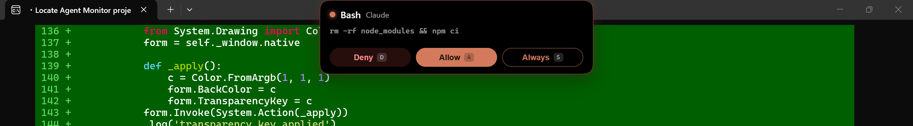
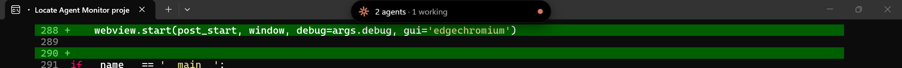
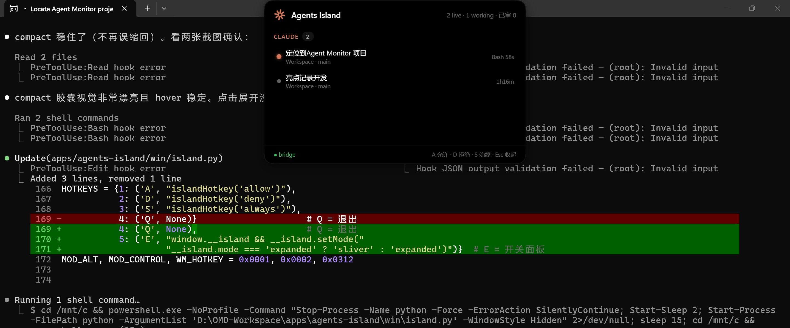

# 🏝️ Agents Island

**An iOS Dynamic Island for your coding agents — on Windows, monitoring WSL.**

A frameless, shape-shifting island docked at the top-center of your Windows screen that monitors **Claude Code / Codex / Gemini CLI / Kimi CLI** sessions running inside WSL, pops up when an agent asks for tool permission, and lets you approve with one key — even while you're in another app.

> Windows 11 + WSL2 是目前少有的「灵动岛式 Coding Agent 监控」组合实现：宿主机 Windows 原生异形透明窗 + WSL 内会话扫描，跨系统实时联动。



## States 四态

| State | Trigger | What you see |
|-------|---------|--------------|
| **Sliver** | default / auto-collapse | a 5px breathing light bar at the very top edge (orange = ok, red pulse = pending approval) |
| **Compact** | hover the top-center edge | pill: `✳ N agents · M working` + per-agent colored dots |
| **Approval** | an agent requests permission | auto pops: tool name, command preview, **Deny / Allow / Always** |
| **Expanded** | click the pill or `Ctrl+Alt+E` | full panel: all live sessions grouped by agent, status, branch, runtime + inline approvals |




## Hotkeys

| Key | Action | Scope |
|-----|--------|-------|
| `A` / `D` / `S` / `Esc` | Allow / Deny / Always / collapse | island focused |
| `Ctrl+Alt+A` / `D` / `S` | approve oldest pending | **global** |
| `Ctrl+Alt+E` | toggle expanded panel | **global** |
| `Ctrl+Alt+Q` | quit | **global** |

System tray icon included (double-click = toggle panel). No taskbar button.

## Requirements

- Windows 11 (10 should work) + WSL2 with your coding agents running inside
- Windows Python 3.10+（`python.org` 安装版，勾选 Add to PATH）
- WebView2 Runtime（Win11 自带）
- Claude Code with hooks support

## Install 安装

```powershell
git clone https://github.com/garvinwong/agents-island.git
cd agents-island
powershell -ExecutionPolicy Bypass -File scripts\install.ps1
```

The installer: checks Python → installs `pywebview` → merges approval/notification hooks into your WSL `~/.claude/settings.json`（只追加不覆盖，自动备份）→ optional autostart shortcut.

Non-default WSL distro? Put its name in `launch/distro.txt` (see `distro.txt.example`).

Then double-click **`launch/AgentsIsland.vbs`** — it idempotently starts the WSL bridge and the island.

## Architecture

```
┌─────────────── Windows ───────────────┐
│ win/island.py                          │   pywebview 6 + WebView2
│  frameless · transparent (color-key)   │   Win32 SetWindowPos geometry
│  global hotkeys · tray icon            │   single-instance mutex
└───────────────┬───────────────────────┘
                │ http://127.0.0.1:5599
┌───────────────▼──────────── WSL ──────┐
│ bridge/island_bridge.py  (stdlib only) │
│  ├─ session scanners (vendored from    │
│  │   agent-monitor, MIT)               │
│  ├─ tails /tmp/claude_perm_queue.jsonl │
│  └─ writes approval response files     │
└────────────────────────────────────────┘
```

- **Approval protocol**: `PreToolUse` hook enqueues the call and blocks (35s timeout → allow); the island writes `{"decision":"allow"|"deny"}` to the response file. `Always` writes a session-scoped flag cleared on the agent's next Stop.
- **Self-healing**: the island reloads its page automatically when the bridge comes back; adaptive scanning throttles to near-zero CPU when the island is closed.
- UI is plain HTML/CSS/JS — open `http://127.0.0.1:5599/` in any browser to hack on it; spring-curve morphing, blur cross-fades, content dirty-checking.

## Tests

```bash
python3 -m pytest tests/test_bridge.py -v   # bridge protocol (sandboxed, 10 cases)
python3 tests/ui_test.py                    # Playwright UI (23 cases)
```

## Credits

Session scanners vendored from [agent-monitor](https://github.com/garvinwong/agent-monitor) (MIT). Design informed by Apple's Dynamic Island HIG and the macOS notch-app ecosystem (CodeIsland, claude-island, boring.notch).

## License

MIT
